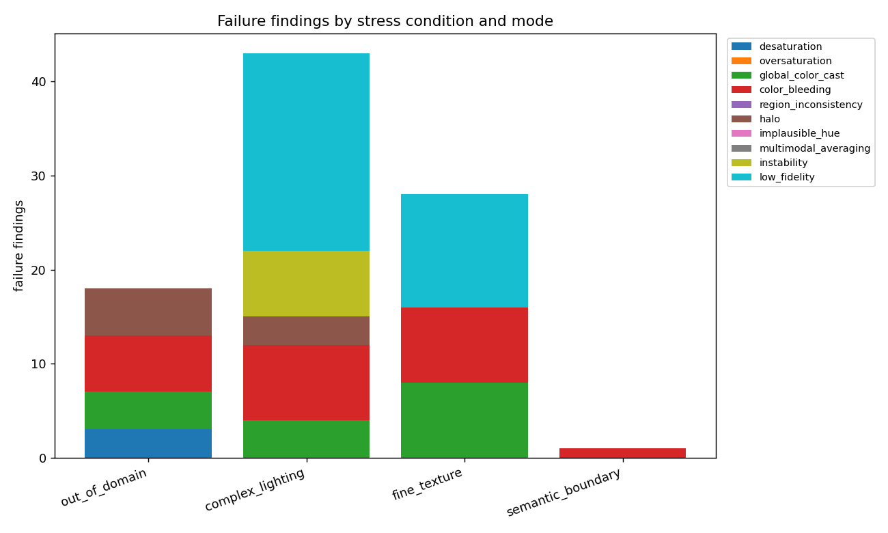
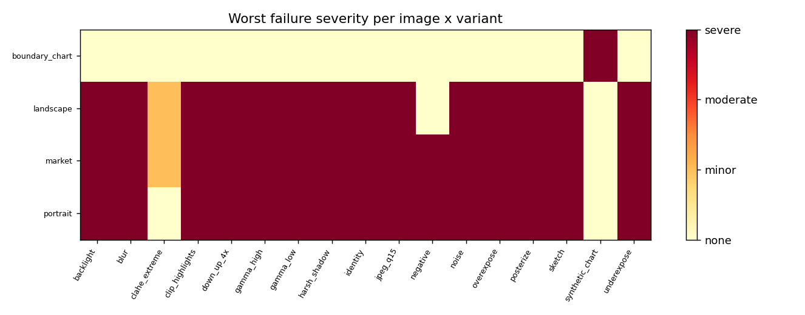
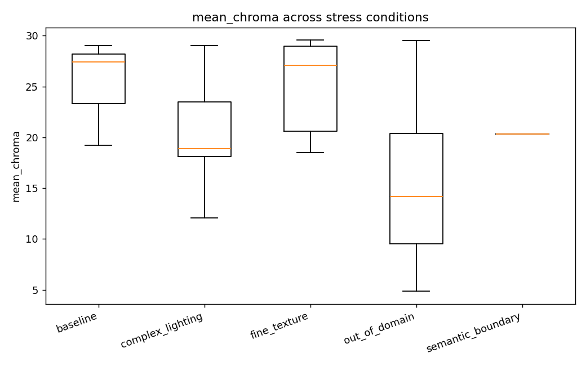
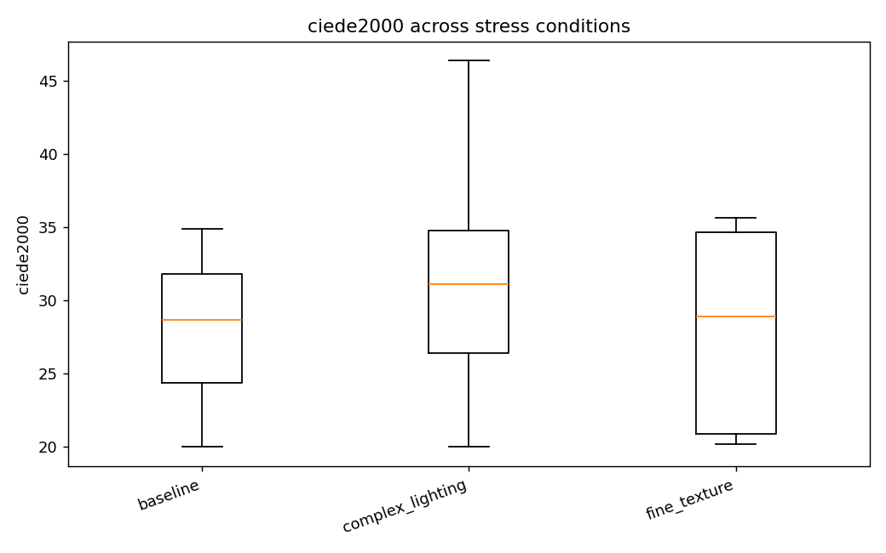
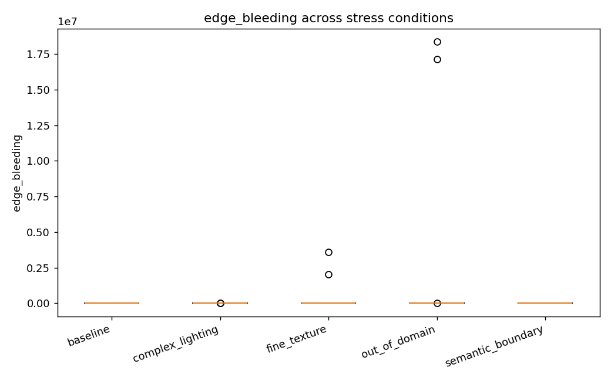
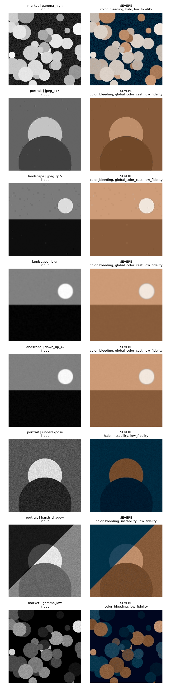

# Failure Analysis Report — MockColorizer (smoke test)

## 1. Overview

- Total (image, stress-variant) evaluations: **49**
- Evaluations exhibiting at least one failure: **47 (96%)**

### Failure rate by stress condition

| Stress condition | Evaluated | With failure | Rate |
|---|---:|---:|---:|
| baseline | 3 | 3 | 100% |
| complex_lighting | 21 | 21 | 100% |
| fine_texture | 12 | 12 | 100% |
| out_of_domain | 12 | 10 | 83% |
| semantic_boundary | 1 | 1 | 100% |

### Most common failure modes

| Failure mode | Count |
|---|---:|
| low_fidelity | 36 |
| color_bleeding | 24 |
| global_color_cast | 18 |
| halo | 8 |
| instability | 7 |
| desaturation | 3 |

## 2. Figures

**Failures by stress condition**

**Severity heatmap**

**Distribution of mean_chroma**

**Distribution of ciede2000**

**Distribution of edge_bleeding**

## 3. Taxonomy — where and how the model fails

### out_of_domain

- Expected failure modes: desaturation, global_color_cast, implausible_hue, multimodal_averaging
- Observed failure modes: color_bleeding (6), halo (5), global_color_cast (4), desaturation (3)

  - **color_bleeding** — Colour leaks across object boundaries so that an object's hue spills onto its neighbour. Measured as chroma variation concentrated on luminance edges.
  - **halo** — A thin ring of anomalous chroma hugs high-contrast edges, a classic artefact of upsampling a low-resolution ab prediction.
  - **global_color_cast** — A single hue dominates the whole frame (e.g. everything tinted teal), usually triggered by an unusual global luminance statistic.

### complex_lighting

- Expected failure modes: global_color_cast, desaturation, instability, low_fidelity
- Observed failure modes: low_fidelity (21), color_bleeding (8), instability (7), global_color_cast (4), halo (3)

  - **low_fidelity** — With a colour ground-truth available, the predicted colours are far from the true colours (high CIEDE2000 / ab error).
  - **color_bleeding** — Colour leaks across object boundaries so that an object's hue spills onto its neighbour. Measured as chroma variation concentrated on luminance edges.
  - **instability** — A small, colour-preserving change to the input (mild lighting shift, light blur) produces a disproportionately large change in the output colours.

### fine_texture

- Expected failure modes: region_inconsistency, halo, instability
- Observed failure modes: low_fidelity (12), global_color_cast (8), color_bleeding (8)

  - **low_fidelity** — With a colour ground-truth available, the predicted colours are far from the true colours (high CIEDE2000 / ab error).
  - **global_color_cast** — A single hue dominates the whole frame (e.g. everything tinted teal), usually triggered by an unusual global luminance statistic.
  - **color_bleeding** — Colour leaks across object boundaries so that an object's hue spills onto its neighbour. Measured as chroma variation concentrated on luminance edges.

### semantic_boundary

- Expected failure modes: color_bleeding, halo, region_inconsistency
- Observed failure modes: color_bleeding (1)

  - **color_bleeding** — Colour leaks across object boundaries so that an object's hue spills onto its neighbour. Measured as chroma variation concentrated on luminance edges.

## 4. Qualitative examples (worst cases)

- `market` / `gamma_high` — **severe** — color_bleeding, halo, low_fidelity
- `portrait` / `jpeg_q15` — **severe** — color_bleeding, global_color_cast, low_fidelity
- `landscape` / `jpeg_q15` — **severe** — color_bleeding, global_color_cast, low_fidelity
- `landscape` / `blur` — **severe** — color_bleeding, global_color_cast, low_fidelity
- `landscape` / `down_up_4x` — **severe** — color_bleeding, global_color_cast, low_fidelity
- `portrait` / `underexpose` — **severe** — halo, instability, low_fidelity
- `portrait` / `harsh_shadow` — **severe** — color_bleeding, instability, low_fidelity
- `market` / `gamma_low` — **severe** — color_bleeding, low_fidelity

## 5. Method notes

- Ground-truth is obtained by converting colour photos to grayscale, colorizing, and comparing to the original. Reference metrics (PSNR, SSIM, CIEDE2000, ab-MSE) are only applied to scene-colour-preserving variants (lighting, texture); out-of-domain variants use no-reference and stability metrics only.
- Severity is graded relative to detection thresholds (`configs/default.yaml`); tune these to your dataset before drawing hard conclusions.
- The synthetic boundary chart isolates colour-bleeding and halo behaviour on hard luminance edges.
